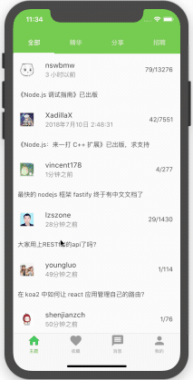
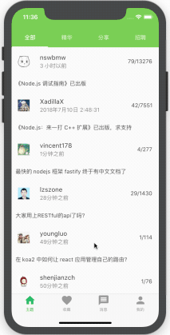

# cnoder

Yet another [cnodejs.org](http://cnodejs.org) Flutter App

## ScreenShot

## Develop
make sure finish [install Flutter](https://flutter.io/get-started/install/) successful

1. clone this repo
`git clone https://github.com/ali322/cnoder.git`
2. install all the packages
`flutter packages get`
3. run the app in simulator on your own
`flutter run`

## Packages in using
cnoder build on following packages
* [fluro](https://pub.dartlang.org/packages/fluro)
* [http](https://pub.dartlang.org/packages/http)
* [redux](https://pub.dartlang.org/packages/redux)
* [flutter_redux](https://pub.dartlang.org/packages/flutter_redux)
* [redux_epics](https://pub.dartlang.org/packages/redux_epics)
* [redux_persist](https://pub.dartlang.org/packages/redux_persist)
* [redux_persist_flutter](https://pub.dartlang.org/packages/redux_persist_flutter)
* [rxdart](https://pub.dartlang.org/packages/rxdart)
* [barcode_scan](https://pub.dartlang.org/packages/barcode_scan)
* [pull_to_refresh](https://pub.dartlang.org/packages/pull_to_refresh)
* [flutter_markdown](https://pub.dartlang.org/packages/flutter_markdown)
* [cached_network_image](https://pub.dartlang.org/packages/cached_network_image)
* [share](https://pub.dartlang.org/packages/share)

## Todo

- finish more scenes
- fix some unknow bugs

## License

[MIT License](http://en.wikipedia.org/wiki/MIT_License)
